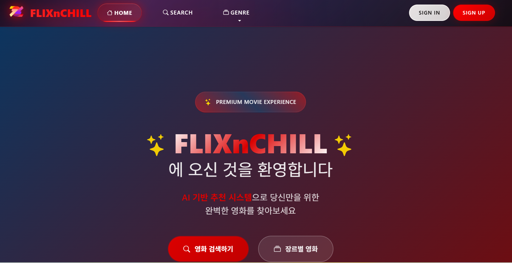
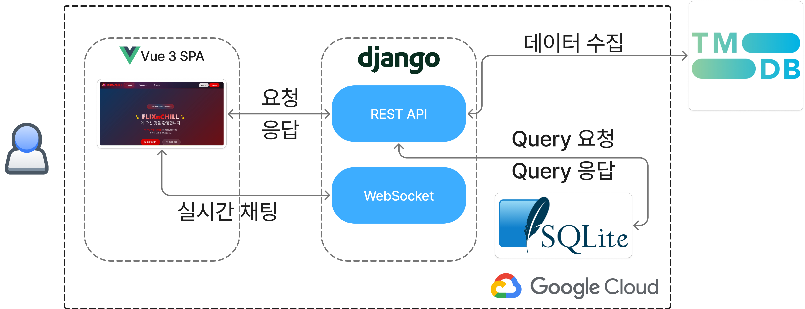

## 🎯 **프로젝트 목표**

### 목표

**“FlixnChill” 은 다양한 영화 정보를 장르별, 평점별로 제공하며 리뷰 및 별점을 달 수 있는 커뮤니티를 제공합니다. 또한, 작성한 영화 리뷰를 바탕으로 취향에 맞는 영화를 추천하고 취향이 비슷한 유저와 소통할 수 있는 커뮤니티 기능 또한 제공합니다.**

### 배경

영화 취향이 맞는 사람과 함께 재미있는 영화 이야기를 나눌 수 있는 커뮤니티 서비스를 제공하고자 하였습니다.

영화 평점 및 리뷰 기능을 바탕으로 추천 알고리즘을 통해 취향에 맞는 새로운 영화를 추천 받고, 영화 취향이 비슷한 사람을 매칭 해주는 서비스를 통해 다른 소개팅 서비스와 차별점을 두었습니다.

### 주요 기능

영화 리뷰, 별점 등 **상호작용 할 수 있는 커뮤니티 서비스**를 제공하고, 이 리뷰 결과를 이용하여 취향에 맞는 **영화를 추천**해줄 뿐 만 아니라 그 사용자와 **비슷한 취향을 가지고 있는 유저를 추천**해주고 그 유저와 **채팅을 할 수 있는 서비스**를 제공합니다.

## 👥 **담당 역할 및 기여**

### 역할

DB model 구성, BE REST API 구현, FE store 및 API 연결, 추천 알고리즘 구현

### 기여

- **프로젝트 기획 및 설계**: 전체 서비스 아키텍처 설계 및 요구사항 분석
- **배포 환경 구성 및 운영**: GCP를 활용한 클라우드 인프라 구축
- **API 설계 및 명세서 작성**: RESTful API 설계 원칙에 따른 체계적인 API 구조 설계
- **RESTful API 서버 개발**: Django REST Framework를 활용한 백엔드 API 개발
- **사용자 인증 및 권한 관리**: JWT 기반 인증 시스템 구현 및 권한 별 접근 제어
- **영화 데이터 수집 및 추천 알고리즘**: TMDB API 연동 및 코사인 유사도 기반 추천 시스템 개발
- **데이터베이스 설계 및 최적화**: 효율적인 ERD 설계 및 쿼리 성능 최적화
- **FE store 관리 및 API 연결**: Vue.js Pinia를 활용한 상태 관리 및 비동기 API 통신 구현

## 🛠️ **사용 기술/이유**

### Django

**선택 이유**

- Django는 Python BE framework로 다양한 기능을 지원하는 외부 라이브러리들이 많고, 빠른 개발이 가능한 MVT 패턴을 제공합니다.
- Django REST Framework를 통해 체계적인 API 개발이 가능하며, 인증/권한 관리 기능이 내장되어 있습니다.
- ORM을 통한 데이터베이스 추상화로 효율적인 데이터 관리가 가능합니다.

### Vue.js

**선택 이유**

1. 컴포넌트 기반 아키텍처로 재사용 가능한 UI 구성요소 개발이 용이합니다.
2. 양방향 데이터 바인딩과 반응형 데이터 처리로 동적인 사용자 인터페이스 구현이 가능합니다.
3. 러닝 커브가 낮아 빠른 학습과 개발이 가능합니다.

### SQLite

**선택 이유**

1. 별도의 서버 설치 없이 파일 기반으로 동작하여 개발 및 테스트 환경 구축이 간편합니다.
2. 경량화되어 있어 프로토타입 개발에 적합하며, Django와의 호환성이 우수합니다.
3. 트랜잭션 지원으로 데이터 무결성을 보장합니다.

### GCP (Google Cloud Platform)

**선택 이유**

1. 안정적인 클라우드 인프라를 제공합니다.
2. 비용 효율적인 요금제와 무료 크레딧으로 프로젝트 초기 단계에 적합합니다.

## 🏗️ **구현 사항**

### 데이터 수집

TMDB API를 사용해 500+ 영화 데이터를 수집했습니다. 서비스를 통해 사용자 리뷰, 별점 등의 상호작용 데이터를 수집하여 개인화된 추천 시스템의 기반 데이터로 활용했습니다.

### 영화 추천 알고리즘 (코사인 유사도 방법)

사용자가 영화에 남긴 별점을 이용하여 사용자별 장르 선호도 비율을 계산하고, 이 정보와 DB의 영화 장르 정보의 코사인 유사도를 계산하여 가장 높은 유사도를 갖는 영화를 추천하였습니다.

**알고리즘 특징:**

- **장점**: 간단한 구현, 빠른 속도, 적절한 추천 정확도
- **단점**: 추천 결과의 다양성 부족
- **해결책**: 다양한 사용자 정보와 활동 데이터를 활용한 하이브리드 추천 시스템으로 개선 예정

### 핵심 기능 구현

### 🔐 사용자 인증 시스템

- 회원가입/로그인/로그아웃 완전 구현
- JWT 기반 토큰 인증 및 프로필 관리
- 팔로우/언팔로우 시스템 및 소셜 기능

### 🎬 영화 서비스

- TMDB API 연동으로 실시간 영화 데이터 제공
- 고급 검색 및 필터링 (장르, 평점, 연도별)
- 개인화된 추천 시스템 및 개인 컬렉션 관리

### 📝 리뷰 & 평가 시스템

- 5점 만점 평점 시스템 (0.5점 단위)
- 리뷰 작성/수정/삭제 및 상호작용 기능

### 💬 실시간 채팅

- 채팅 UI/UX 완전 구현
- WebSocket 기반 실시간 통신

## 🌐Product Serving

## 🚨 **문제 해결 사례**

### API 응답 속도 저하

**문제 상황**: TMDB API 호출 시 대량의 영화 데이터 요청으로 인한 응답 속도 저하

**해결 방법**:

- 페이지네이션을 통한 데이터 분할 로딩 구현 (20개씩 분할)
- 비동기 처리를 통한 사용자 경험 개선

### CORS 에러로 인한 프론트엔드-백엔드 통신 오류

**문제 상황**: Vue.js에서 Django API 호출 시 CORS 정책으로 인한 요청 차단

**해결 방법**:

- Django에서 `django-cors-headers` 패키지 설치 및 설정
- 개발/운영 환경별 CORS 허용 도메인 분리 관리
- Preflight 요청 처리를 위한 OPTIONS 메서드 허용

### GCP 배포 시 하드코딩된 API URL 문제

**문제 상황**: 개발 환경에서 `localhost:8000`으로 하드코딩된 API URL로 인해 GCP 배포 후 API 호출 실패

**해결 방법**:

- Vue.js에서 환경 변수 파일(`.env.development`, `.env.production`) 분리 생성
- `process.env.VUE_APP_API_BASE_URL`을 통한 동적 API URL 설정
- Django settings에서도 `ALLOWED_HOSTS`와 `CORS_ALLOWED_ORIGINS`를 환경별로 분리

## 📊 **프로젝트 성과**

### 기술적 성과

- **완전한 풀스택 웹 애플리케이션** 개발 완료
- **500+ 영화 데이터** 실시간 연동 성공
- **RESTful API 설계 및 구현** 완료 (20+ 엔드포인트)
- **반응형 웹 디자인** 구현으로 다양한 디바이스 지원
- **실시간 채팅 시스템** 구현

### 유저 피드백

- 직관적이고 사용하기 편한 UI/UX 디자인에 대한 긍정적 평가
- 개인화된 영화 추천 기능의 높은 만족도
- 소셜 기능을 통한 영화 취향 공유의 재미

### 프로젝트 1등

**SSAFY 13기 1학기 관통 프로젝트**에서 **반** **1등**을 수상하며 기술적 완성도와 창의성을 인정받았습니다.

## 🔄 **프로젝트 회고**

### 아쉬웠던 점

- **실시간 채팅 기능의 완전한 구현** 부족
    
    WebSocket 연결 안정성 및 실시간 알림 시스템 미완성
    
- **고급 추천 알고리즘** 부재
    
    단순 코사인 유사도 외의 다양한 추천 방식 적용 부족
    
- **사용자 테스트** 부족
    
    실제 사용자 피드백을 통한 UX 개선 기회 부족
    

### 개선 방안

- **WebSocket 연결 최적화**
    
    안정적인 실시간 통신 구현 및 알림 시스템 구현
    
- **머신러닝 기반 추천 시스템**
    
    협업 필터링, 딥러닝 모델 도입
    
- **성능 최적화**
    
    데이터베이스 인덱싱, 쿼리 최적화
    
- **사용자 경험 개선**
    
    A/B 테스트를 통한 UI/UX 지속적 개선
    

### 새롭게 알게 된 지식 및 개발 역량

- **Vue.js Composition API**
    
    재사용 가능한 컴포넌트 로직 구성 방법 습득
    
- **Django REST Framework**
    
    체계적인 API 설계 및 시리얼라이저 활용 능력 향상
    
- **클라우드 배포**
    
    GCP를 활용한 실제 서비스 배포 경험 획득
    
- **추천 시스템**
    
    코사인 유사도 기반 추천 알고리즘 이해 및 구현 능력 향상
    
- **팀 협업**
    
    Git을 활용한 협업 방식 및 코드 리뷰 문화 경험
    

### 깨달은 점

- **사용자 중심 개발**의 중요성
    
    기술적 완성도보다 사용자 경험이 서비스의 성공을 좌우함을 깨달음
    
- **점진적 개발**의 필요성
    
    MVP(Minimum Viable Product) 개념을 통한 핵심 기능 우선 구현의 중요성
    
- **협업의 가치**
    
    개인 개발 대비 팀 개발에서의 코드 품질 향상 및 학습 효과 체험
    
- **지속적인 학습**
    
    빠르게 변화하는 기술 트렌드에 대한 지속적인 학습과 적응의 필요성 인식
